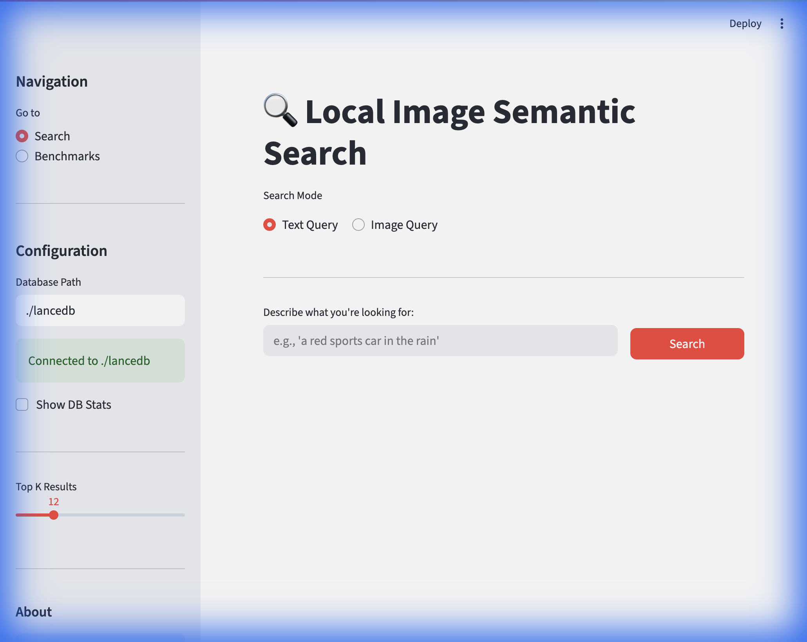
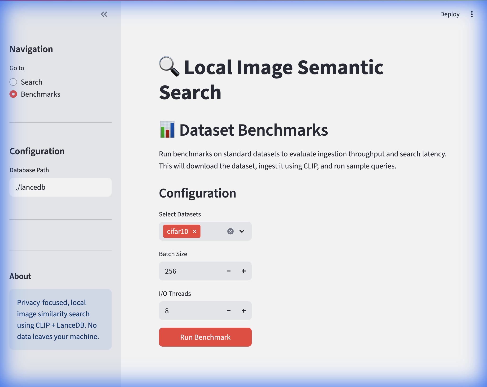
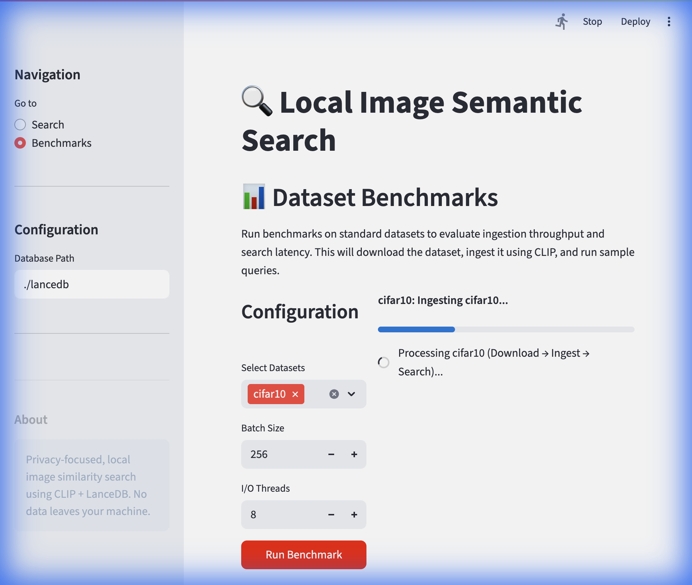
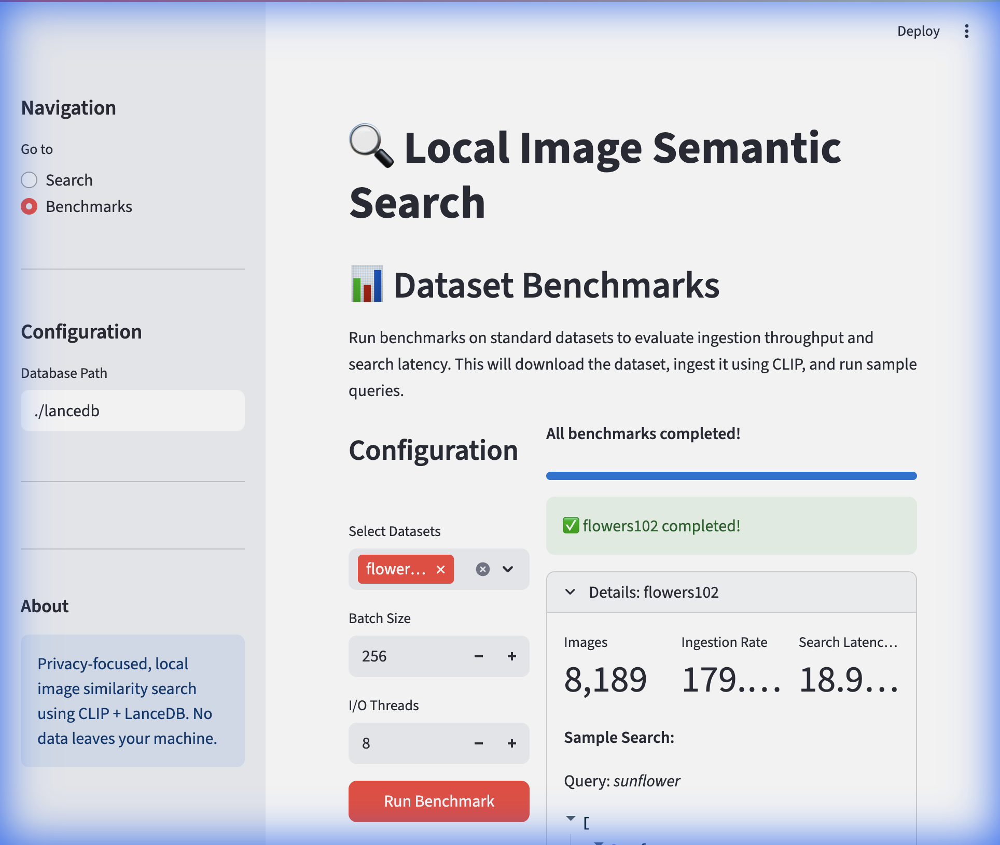

# Local Similarity Search Engine

A high-performance similarity search engine that runs entirely on your local machine. Find the most similar images to a query — by image or text — across millions of files, without sending your data to the cloud.

## Features

-   **Privacy-Focused**: All data and computations stay on your machine.
-   **High Performance**: LanceDB disk-backed vector store + CLIP embeddings, optimized for 1M+ images and multi-TB datasets.
-   **Cross-Modal Search**: Search by image path *or* text description (e.g., "a red car").
-   **Simple CLI**: One-command ingestion and search.

## Performance Estimates

### Search Latency (10K vectors benchmark)

| Metric | Value |
|---|---|
| Ingestion | **43,655 vectors/sec** |
| Query (median) | **3.30 ms** |
| Query (P95) | **3.66 ms** |
| Query (P99) | **4.82 ms** |

### Indexing Time for 1TB of Images

Assumes ~333K images at ~3MB average, or ~2M images at ~500KB average. CLIP embedding is the bottleneck, not disk I/O or vector storage.

#### ~333K images (3MB avg / 1TB total)

| Hardware | Throughput | Time |
|---|---|---|
| CPU only (M-series Mac) | ~40 imgs/sec | **~2.3 hours** |
| Apple MPS (M1/M2/M3) | ~300 imgs/sec | **~18 minutes** |
| NVIDIA GPU (RTX 3090+) | ~500 imgs/sec | **~11 minutes** |

#### ~2M images (500KB avg / 1TB total)

| Hardware | Throughput | Time |
|---|---|---|
| CPU only (M-series Mac) | ~40 imgs/sec | **~14 hours** |
| Apple MPS (M1/M2/M3) | ~300 imgs/sec | **~1.8 hours** |
| NVIDIA GPU (RTX 3090+) | ~500 imgs/sec | **~1.1 hours** |

> **Note**: The engine auto-detects the best available device (CUDA → MPS → CPU).

## Getting Started

### Prerequisites

Python 3.8 or higher.

### Installation

```sh
git clone <your-repository-url>
cd image-similarity
pip install -r requirements.txt
```

## Usage

### Ingest images from a directory

```sh
python main.py ingest --data-dir /path/to/images --batch-size 256 --workers 8
```

### Search by text

```sh
python main.py search --query "a red car" --top-k 10
```

### Search by image

```sh
python main.py search --query /path/to/query.jpg --top-k 10
```

### Build ANN index (after ingestion, for faster search at scale)

```sh
python main.py create-index
```

### Show table stats

```sh
python main.py stats
```

### Benchmark Datasets

Download standard datasets and run similarity search demos.

**Available datasets:** CIFAR-10 (60K), STL-10 (113K), Oxford Flowers 102 (8K), Caltech-101 (9K)

```sh
# List available datasets
python main.py download --list

# Download a dataset
python main.py download --dataset cifar10 --dest ./data

# One-shot demo: download → ingest → search
python main.py demo --dataset cifar10 --query "airplane" --top-k 5
```

### Graphical User Interface (GUI)

Run the Streamlit app for an interactive search experience:

```sh
streamlit run app.py
```






### Run benchmarks

```sh
python benchmarks/bench_search.py --scale 100000 --dim 512
```

## Python API

```python
from similarity_engine import SimilarityEngine

engine = SimilarityEngine(db_path="./mydb")

# Ingest
engine.index(data_dir="/path/to/images", batch_size=256, num_io_threads=8)

# Build index for fast ANN search
engine.create_index()

# Search by text
results = engine.search("a red car", top_k=5)

# Search by image
results = engine.search("/path/to/query.jpg", top_k=5)

for item_id, score in results:
    print(f"{item_id}: {score:.4f}")
```

## Contributing

Contributions are welcome! Please feel free to submit a pull request.

## License

This project is licensed under the MIT License.